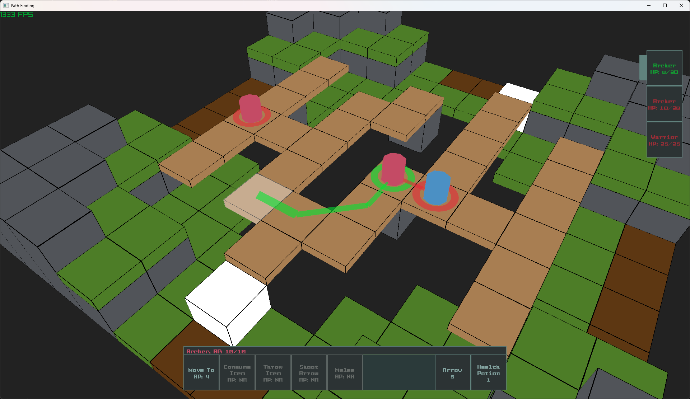
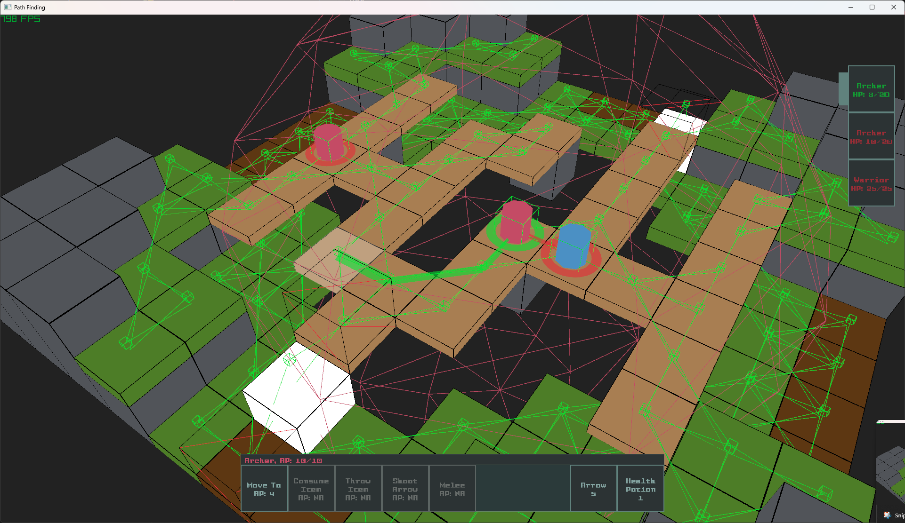
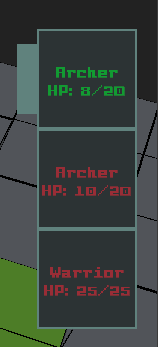
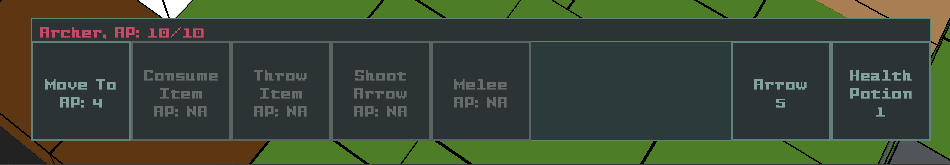

# Custom Project - CRPG Combat Demo

- Author: Ewan Robson
- Student Id: 103992579

## Dependencies

These are all fetched when first running CMake and compiled into static libraries and bundled within the executable as they are static libraries:

- [Raylib](https://github.com/raysan5/raylib)
    - Rendering shapes, platform specific window handling, very easy to use C multi-media library.
- [Raygui](https://github.com/raysan5/raylib)
    - Raylib extension for rendering UI.
    - STB header only library in which I combine into a static library.
- [LibFmt](https://github.com/fmtlib/fmt)
    - Very fast and easy to use string formatting and console printing library.

\newpage

# Running

## Using pre-built executable

- Navigate and run `bin/crpg-combat.exe`
    - Make sure the current working directory is either within the bin folder or in the projects root directory. The executable requires access to the assets folder and will recursively search from cwd backward until it finds the folder.

## Building

**_Note: Only tested compiling on Windows using MSVC and LLVM/Clang. I have no idea if it compiles/runs on Linux/Mac_**

### Using MSVC

- Install [CMake](https://cmake.org/download/).
- Install [Visual Studio](https://visualstudio.microsoft.com/downloads/) with C++ workloads.
- Generate solution:
    - Open terminal in project root.
    - Run script `gen_msvc_project.bat`.
        - _Initial run fetches dependencies which may take some time._
        - Alternatively run `cmake -S . -B build -G "Visual Studio 17 2022" -A x64`, which the bat script calls anyways.
- Build:
    - Open `./build/crpg-combat.sln` in Visual Studio.
    - Build solution by pressing Ctrl+Shift+B.
- Run:
    - Right-click `crpg-combat` project in Solution Explorer.
    - Click "Set as Startup Project".
    - Execute.
        - F5: Run within editor
        - Open Terminal and execute `./build/Debug/crpg-combat.exe` from within the root

### Using Ninja and Clang

- Install [CMake](https://cmake.org/download/).
- Install [LLVM/Clang](https://llvm.org/).
- Install [Ninja](https://ninja-build.org/).
    - Can use any other generator that CMake supports.
- Add CMake, Ninja, and Clang to system PATH.
- Generate build files:
    - Open terminal in project root.
    - Run `gen_ninja_clang.bat`.
        - _Initial run fetches dependencies which may take some time._
        - Alternatively run `cmake -S . -B build -G "Ninja" -D CMAKE_C_COMPILER=clang -D CMAKE_CXX_COMPILER=clang++`, which the bat script calls anyways.
        - If you want lsp support append `-DCMAKE_EXPORT_COMPILE_COMMANDS=ON` to generate compile_commands.json and point lsp it from the build folder.
- Build:
    - Run `cmake --build build`.
- Run:
    - Execute `./build/crpg-combat.exe`.

# How to use

- **Enter Debug Mode** by pressing the Escape key
- **Update Level** by navigating to `assets/maps/MainLevel.toml` and editing it there. You cannot add any more actor or tile IDs, the program will crash. However you can freely edit the world size, tile/actor placements, or actor attribute values (as long as they stay the same type).

## Camera Controller

The camera functions similar to [Baldur's Gate 3](https://baldursgate3.game/):

- **Rotate Camera:** Hold middle mouse button and move mouse left to right.
- **Zoom into world:** Scroll mouse wheel.
- **Move the camera:** WASD keys.

\newpage

## Character Abilities, Actions and Turn Order

**Character's turn order** are visually shown on the right, the lighter bar indicates the current characters turn. Characters with higher dexterity are ordered first. You can click on any of the characters within the turn order to see their actions updated. The colour of the the text indicates which team they are on and friendly fire is not supported.

**Performing characters actions** is done by interacting with the action bar at the bottom of the screen which includes all actions with their AP cost to perform on the left and all items within their inventory on the right. Greyed out actions cannot be performed while for items, it means its selected.

**Moving a character:**

1. Select a walkable tile by clicking anywhere within the map. The tile will start highlighting indicating its selected.
2. Interact with the Action bar and select the **Move to** action. The character will follow the path to its destination.

**Consuming an item:**

1. Select the item you wish to consume in the action bar on the right.
2. Select the **Consume Item** action.

**Melee Attack:**

1. Move within a 1 tile radius, diagonals included. Targets on a higher elevation are out of reach.
2. Select the **Melee** action.

**Shoot Attack:**

1. Move within radius of 5 tiles. When it's the archer's turn, going into debug mode will show range as a wired circle.
2. Select target within the world by clicking on the tile they stand on.
3. Select the **Shoot Arrow** action. It will not let you shoot if they are not in LOS.
